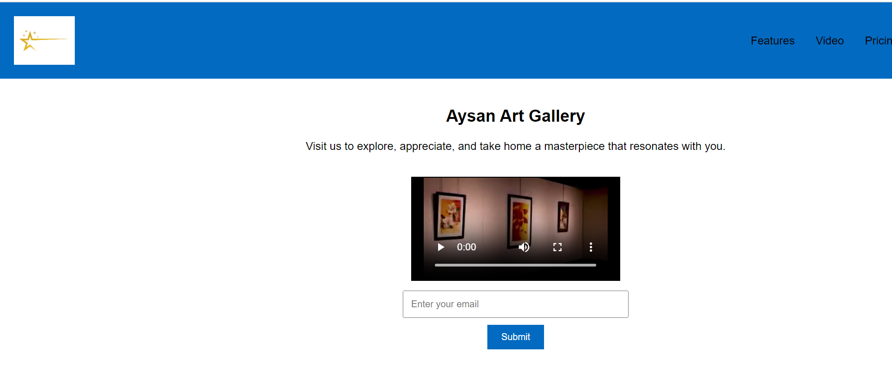

# product-landing-page 🚀
>This repository contains the product landing page for an art gallery product landing page. This page serves as a guide for developers, contributors, and users to understand the architecture, implementation details, and usage instructions for the project. This project is built by html and css. Trough creating this repository, users will learn html and css that how style a webpage. 

To create product landing page:
create a hmlh file.
create a css file.
link correctly the css file in html. (<link<link rel="stylesheet" href="./style.css">
</head>>)

## Demo 📸

## Technologies Used 🛠️
This project is built by:
- HTML
- CSS

## Installation 💻
first install git and create a github account.
Create a repositpry for this project.
clone the project in local machine.
use git comments like git add. git comment, and git push.
git add: it can add our project{git add (your file name)}
git commeit: it can commit the changes.
git push: it push the changes into github.

## Usage 🎯

To use [Technical documentation page ], follow these instructions:
1. First,  create a repositort 
clone the repository and navigate to the project directory:
open git bush and use git clone: 
git clone https://github.com/yourusername/project-name.git
   cd project-name.
2. Installation: Install the required dependencies using git:
git install
3. Configuration: Configure [Project Name] by editing the config.git file.

## Author 👩‍💻

Masoma Rezaie.

- Website: [your-website.com](https://github.com/MasomRezaie/Technical-Documentation-Page/edit/creating-technical-documentation-page/README.md)
- LinkedIn: [Miss Masoma](https://www.linkedin.com/in/miss-masoma-99b85522a?utm_source=share&utm_campaign=share_via&utm_content=profile&utm_medium=android_app)
- Email: [Masoma Rezaie](masom.rezaie135@gmail.com)

## Contributing 🤝

Those who want to contribute in this project with me, can reach out me through:
email:masom.rezaie135@gmail.com
